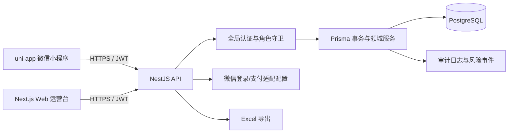

# 系统架构

## 组件

`packages/shared` 保存不依赖框架的业务规则，API 与自动化测试共同使用。金额统一使用整数分；比例使用基点，2000 基点即 20%。

## 业务账本

| 账本 | 计入时点 | 不得混入 |
|---|---|---|
| 场馆经营账 | 订场、球局、赛事、商品、会员等订单支付 | 培训课包预收全额 |
| 培训预收账 | 课包支付 | 尚未发生的培训收入 |
| 培训确认收入 | 真实签到并消课 | 未消课余额、场地占用价值 |
| 场馆合同收入 | 每笔培训确认收入 × 20% | 额外培训场地费 |
| 联盟归因账 | 唯一券核销后的归因 GMV、拉新、合作费 | 联盟商户实收资金 |

## 一致性设计

- 下单价格由服务端按订单日期解析有效价格版本，订单保存完整参数快照。
- 场地、比赛报名、券核销、账户扣款、库存出库使用串行化事务或条件更新防止并发超卖。
- 支付与退款使用幂等键；账户流水和库存流水不可覆盖，只能追加冲正记录。
- 券码、支付、订单号、合同号、报名关系等设置数据库唯一约束。
- 初始迁移增加数据库检查约束，保证账户非负、订单金额恒等、赛事比分有效、核销记录完整，以及培训 20%/零场地费规则。

## 角色边界

`MEMBER` 为默认角色；`FRONT_DESK` 处理签到和现场业务；`COACH` 处理排课与消课；`EVENT_MANAGER` 处理赛事；`HOST` 仅管理自己的球局；`MERCHANT` 仅管理绑定商户；`FINANCE` 处理退款、结算、导出；`ADMIN` 和 `SUPER_ADMIN` 处理配置与授权。

同一用户可有多个角色。商户角色带 `merchantId` 作用域，防止跨商户核销或发券。
