# H5 移动端逐页验收报告

> 验收日期：2026-09-01
> 基线：`main@3b3a645` 加本轮未提交的界面、安全和验收改造
> 数据模式：本地 H5 + mock 数据
> 截图视口：390 × 844；响应式复测：360 × 800；关键经营页补充 320px 抽查

## 1. 验收结论

本轮把“能打开”提升为“可解释、可操作、可在手机宽度使用”。截图基线由逐页自动检查形成；2026-09-01 的最新复验改为智能体直接操作浏览器，不创建新的验收脚本，逐一打开 `pages.json` 注册的 24 个页面，并检查白屏、Vite 错误浮层、页面级横向溢出、非预期文字裁切、越出屏幕的交互控件和关键交互步骤。

最终结果：

- 24/24 个注册页面在 390 × 844 复验可渲染，未发现持续白屏或 Vite 错误浮层；赛事、联盟等重页面需等待异步数据完成，已避免把加载瞬间误判为白屏。
- 390px 与 360px 页面级横向溢出均为 0；场地矩阵和横向标签仍保留业务需要的容器内横滑。
- 非预期文字裁切为 0；按钮、输入框和经营表单触控高度统一到至少 44px。
- 工作台业务中心、两项快捷工作入口、会员快捷入口和个人中心菜单共 23 条真实点击路径全部进入预期页面。
- 管理员待办已实际点击“库存低于安全线”进入带 `focus=low-stock&id=goods-grip` 的库存页，目标记录唯一高亮；七类用户旅程完成页面进入与权限抽查，财务和赛事角色访问完整库存均得到明确无权限状态。
- 普通会员直接访问经营深链时不加载经营数据，统一显示无经营权限和返回会员端入口。
- 库存采购、盘点、调拨、报损和领用不再静默取第一条主数据，必须逐项显式选择。
- “邀请使用小程序”和“邀请加入具体球局”已拆成两条用户旅程；通用邀请使用服务端签发的不透明邀请码，不再把用户 ID 放入分享参数或剪贴板。

需要在微信环境继续验收的项目不计入 H5 通过：微信登录、分享卡片回调、扫码、支付/退款、前后台切换、安全区和体验版真机网络。

## 2. 两类邀请如何组织

### 邀请好友使用小程序

入口放在“个人中心”。用户复制邀请码或分享小程序卡片；分享链接只携带服务端随机生成的邀请码。新用户首次进入后暂存邀请码，登录成功时一次性绑定直接推荐关系，绑定后不可更换，首个有效订单成熟后再发放双方奖励。

### 邀请加入拼场球局

入口放在“球局与赛事”的具体球局卡片。分享文案包含球局名称、时间和人数语义，落地后自动切到日常球局，并把目标球局置顶和高亮。开放球局可直接报名，满员球局仍可邀请并引导好友进入候补。

两条链路不能共用入口：前者解决拉新与推荐归因，后者解决某一场活动的到场转化。当前球局链接仍以目标 `gameId` 完成 H5 路由闭环；上线前建议升级为带球局、邀请人和有效期的服务端签名令牌，避免参数被篡改。

## 3. 自动化口径

每个页面执行以下检查：

1. 使用对应角色从 H5 路由进入，等待异步 mock 数据稳定。
2. 读取可见页面文本，少文本、错误浮层或异常空壳判为疑似白屏。
3. 比较文档宽度与视口宽度；容器内明确设置的横向滚动不判为页面溢出。
4. 检查文本节点的实际尺寸、裁切样式和屏幕边界。
5. 检查按钮、输入框、链接和可点击控件的命中区域。
6. 保存 390 × 844 手机视口截图；长页由 DOM 全量巡检覆盖，并在 360 × 800 下重复无截图巡检。

本轮代码门禁：

- shared：1 个测试文件，13/13 通过。
- API：87 个测试文件，616/616 通过；健康 E2E 1/1 通过。
- H5/小程序：29 个测试文件，151/151 通过。
- API lint、API build、H5 build、Vue TypeScript 检查、Prisma Schema 校验和 `git diff --check` 均通过。
- 本机隔离 PostgreSQL 验收库已从空库应用 29/29 个迁移，`migrate status` 最新且 Schema diff 为空；种子化验收库完成真实 HTTP、权限、并发、退款、隐私和赛事搭档授权回放。

## 4. 会员旅程

### 01 登录

目标是完成微信登录，或在 mock 构建中切换九种联调身份。正式远程构建不得暴露开发身份入口；H5 只能验收布局和角色跳转，不能替代微信授权登录。

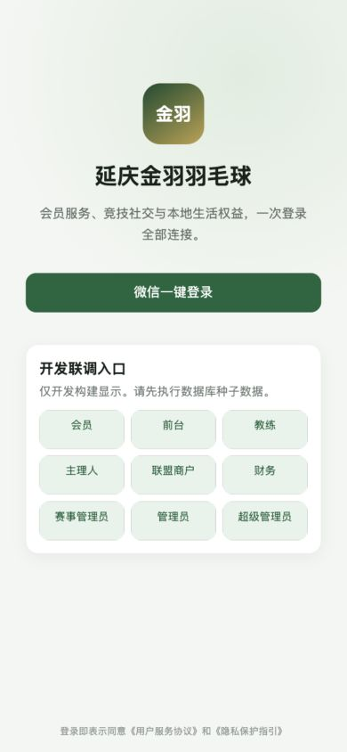

### 02 首页

会员从首页进入订场、找球搭子、培训、联盟权益、会员权益和商城，并查看下一场球局与赛事。卡片长文案可换行，六个快捷入口在手机宽度保持稳定双列布局。

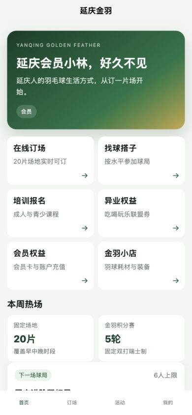

### 03 在线订场

用户选择日期、场地和时段，查看占用/无价/可售状态，使用联盟券并建立 10 分钟待支付订单。20 片场地属于有意的矩阵横滑，不应带动整个页面横向移动。

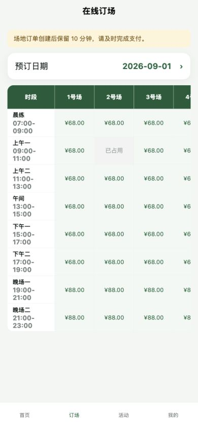

### 04 球局与赛事

日常球局支持报名、候补、退出和“邀请球友”；积分赛支持队伍报名、支付截止、签到、排名与战绩分享。目标球局邀请落地后会置顶高亮，避免好友进入活动总页后再次查找。

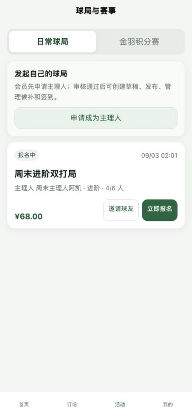

邀请链接冷启动落地状态：

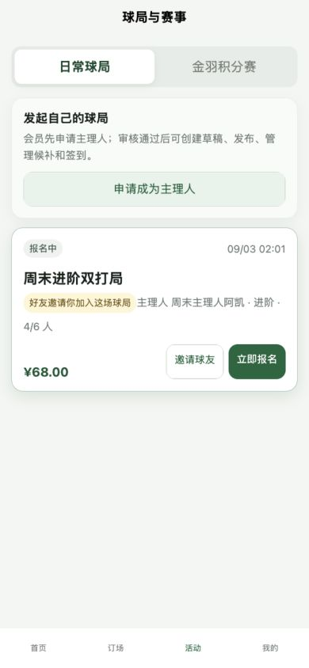

### 05 个人中心

集中展示会员身份、五账户、订单/资产/课程/卡券入口、通用邀请、推荐奖励和隐私注销。推荐链路只在界面和分享参数中传递不透明邀请码，不展示内部用户 ID。

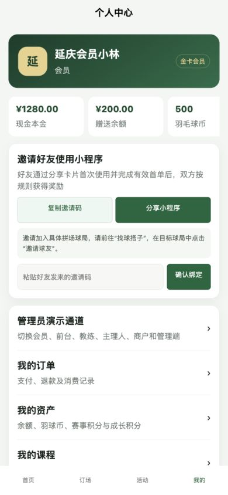

### 06 我的订单

统一承载订场、球局、赛事、培训和商品订单，提供支付与退款动作。消费者界面使用中文业务名称，不直接显示 `VENUE`、`TRAINING` 等内部枚举。

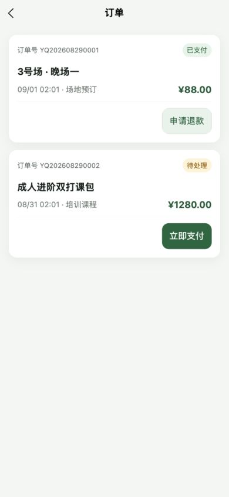

### 07 五账户

现金本金、赠送余额、羽球币、成人赛事积分和青少年成长积分严格分账展示，并提供冻结额与最近流水。现金与积分保留各自单位，不能在前端造成可互相抵扣的暗示。

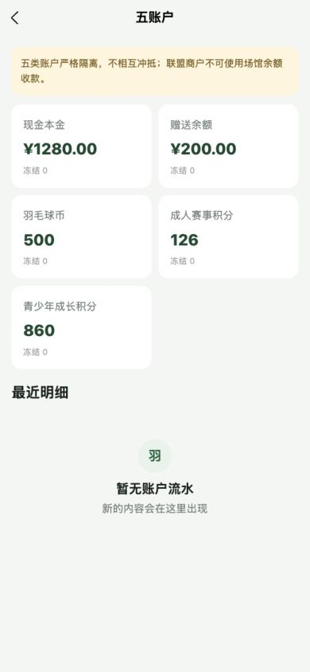

### 08 培训中心

用户查看课程课包、课表、试听结果、青少年学员授权和培训经营账；退费只针对未消课余额。页面内容较多，但账本、课表与测评在窄屏下不横向撑破页面。

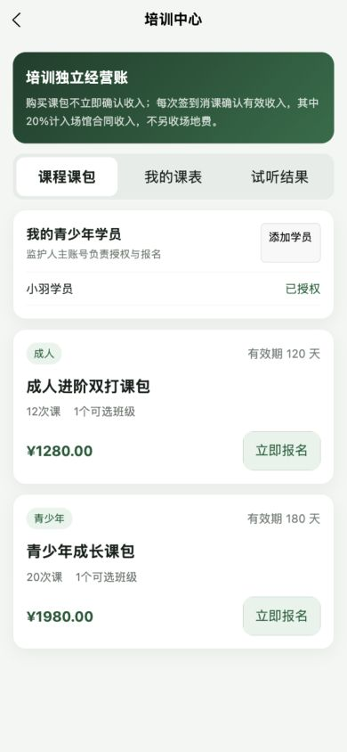

### 09 联盟优惠券

会员输入唯一券码领取权益并查看券包；具有经营权限的角色才出现商户核销区。H5 可验收手输券码和布局，真实扫码必须在微信开发者工具/真机补验。

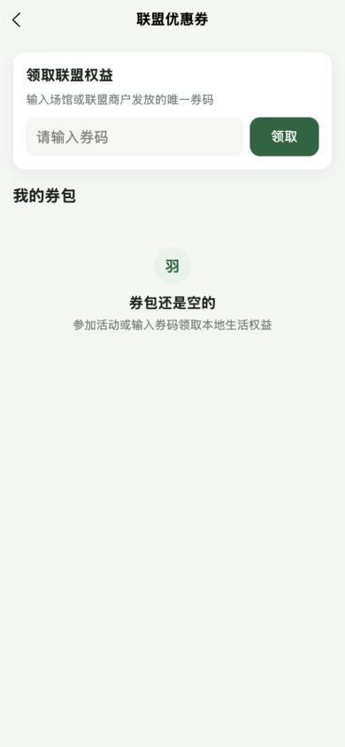

### 10 会员权益

用户选择充值计划或开通会员产品，界面只说明充值额、赠送额、等级和权益，不再展示方案编码、版本号或内部权益键。

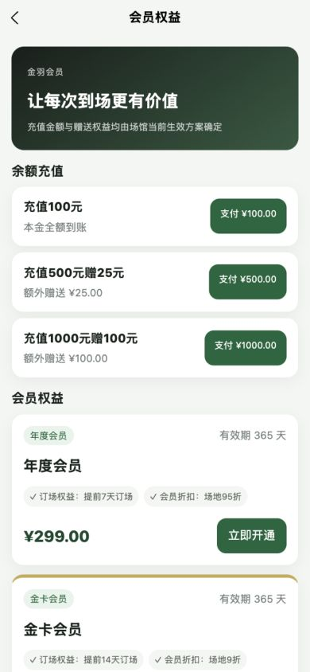

### 11 金羽小店

商品卡显示自营/寄售、库存和售价，用户输入数量建立商品订单。长商品名、价格和购买按钮在双列卡片中可换行且不越界。

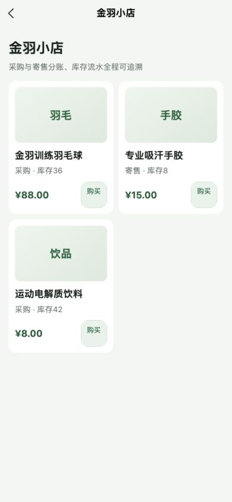

## 5. 身份与经营入口

### 12 管理员演示通道

仅用于 mock 验收，支持九种身份切换和本机演示数据重置。角色说明已中文化；重置动作增加二次确认；正式环境默认关闭身份切换，不向普通用户暴露构建参数。

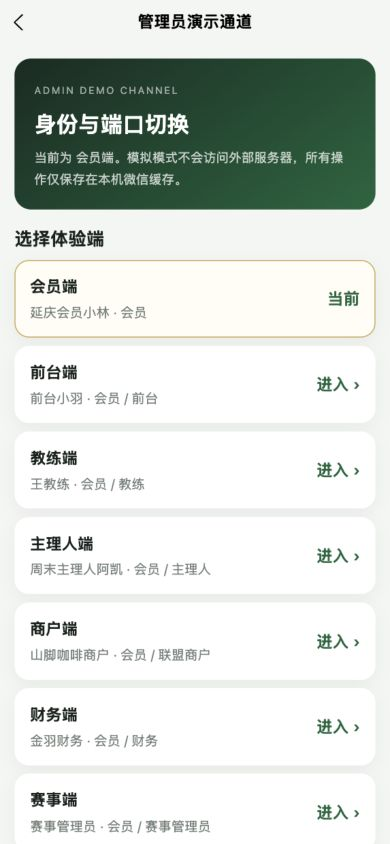

### 13 经营工作台

经营人员先看本人待办、今日指标与首选中心，再按权限进入业务中心；经营分析与现场操作分开。搜索、角色范围和返回会员端组成统一入口，会员深链会得到明确无权限状态。

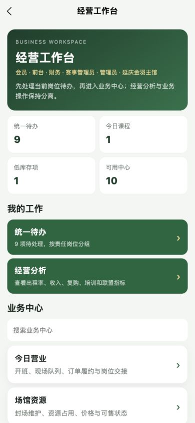

## 6. 经营闭环

### 14 经营总览

按责任岗位聚合待处理事项，并把出租率、收入、复购、培训和联盟指标放到独立分析视图。待办优先、分析其次，避免管理指标淹没现场动作。

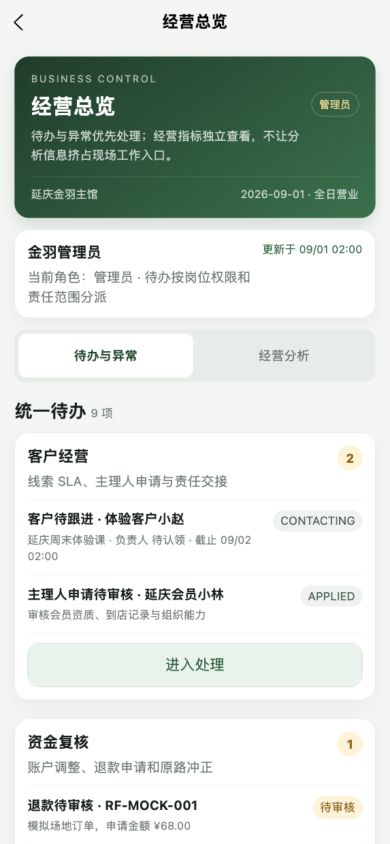

### 15 今日营业

前台按“开班 → 现场订场/收款 → 签到 → 履约/未到 → 退款申请/券核销 → 现金实点关班”工作。窄屏按钮允许换行，管理员应急旁路仍需由后端审计。

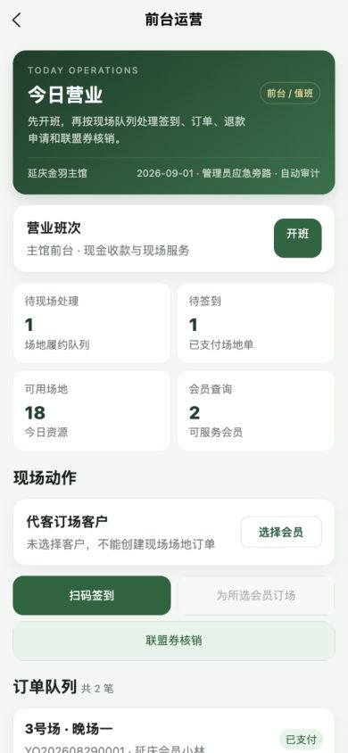

### 16 场馆资源

维护人员查看日期与可售状态，创建或取消封场，并维护版本化价格规则。预约冲突、规则有效期和启停由业务校验；星期选择与长表单在窄屏可正常操作。

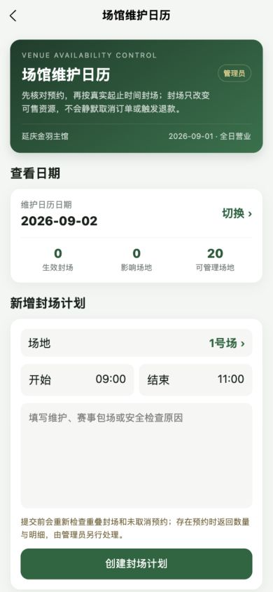

### 17 客户与会员

覆盖主理人审批、客户 360、线索分配/跟进/转会员、账户调整申请、会员产品和充值计划。不同岗位看到不同字段和动作，调账必须进入异人复核。

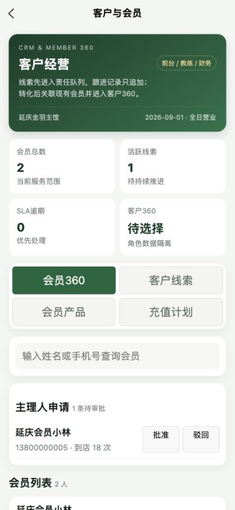

### 18 培训运营

按“试听 → 测评/转课 → 班级排课 → 点名 → 教练建议消课 → 管理员确认 → 收入入账/冲正”闭环。教练不能确认自己的消课，青少年规则和场地冲突由服务端最终阻断。

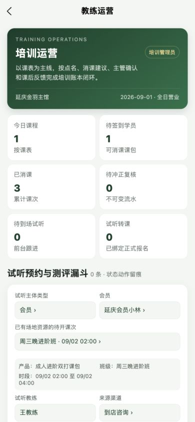

### 19 球局运营

主理人创建草稿、发布报名、处理 FIFO 候补、签到、取消退款并按实际到场人数结算，只能操作本人球局。会员邀请入口位于具体球局卡，而不是经营页。

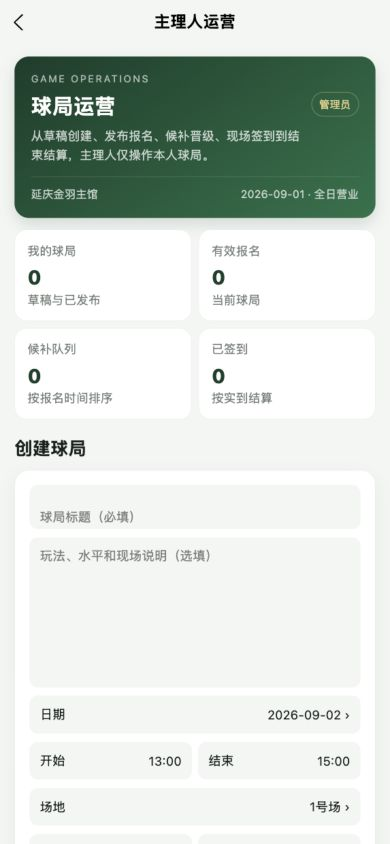

### 20 赛事运营

赛事管理员从草稿发布推进到队伍、候补、支付、签到、五轮瑞士配对、比分确认/纠错、排名、完赛和奖品签收。横向赛事选择是受控滚动，长赛事名和操作区不会裁切。

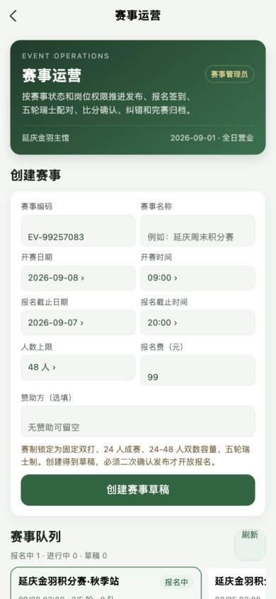

### 21 联盟运营

商户/前台完成唯一券核销，商户确认或争议结算，管理员维护商户、券模板和批量券。经营对象必须受账号数据域约束，批量券码和核销结果不得跨会话泄漏。

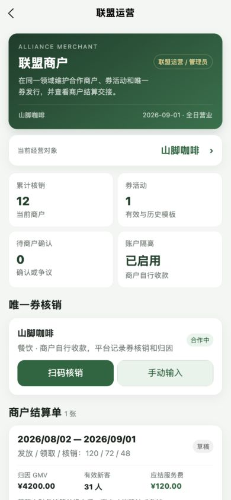

### 22 商品与库存

覆盖库存预警、采购审批与分批收货、盘点复核、调拨报损、培训/赛事领用及 SKU/供应商/库位主数据。所有新单都从空选择开始，商品、供应商、来源/目标库位、业务对象、数量和原因必须显式确认。

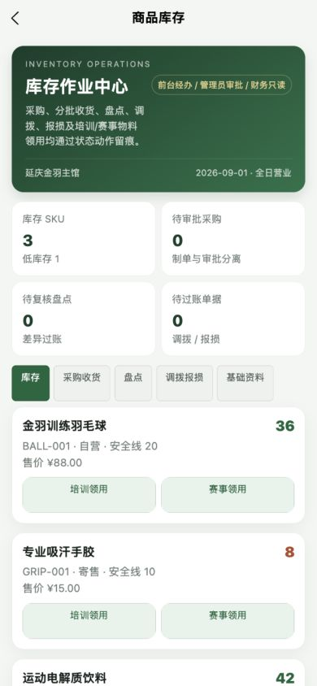

新建采购单的空默认状态：

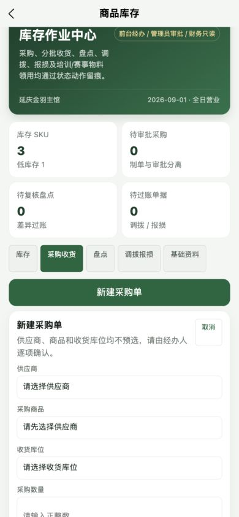

### 23 财务结算

财务核对退款、账户调账、培训收入、寄售应付、班次现金差异、日结和联盟结算，并可导出订单与财务账簿。会员、培训、赛事、联盟、库存、审计及全量导出仅向管理员/超级管理员开放；制单、复核和付款职责要分离，H5 mock 的导出不能替代远程环境真实 XLSX 验收。

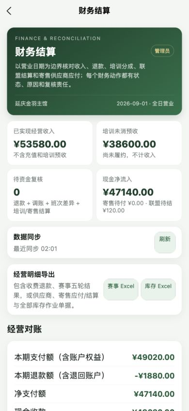

### 24 治理与权限

组织角色、参数版本、风险事件、注销复核、审计日志和数据导出分成六个功能区；窄屏改为两列自适应标签，宽屏保持紧凑导航。匿名化不可逆，必须由另一名超级管理员复核；结构化参数仍由后端做类型、范围和权限校验。

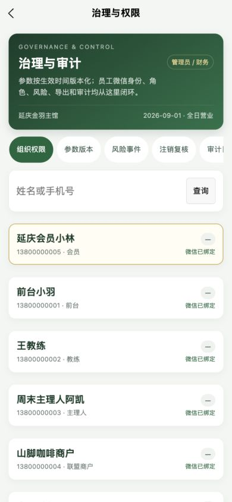

## 7. 本轮修复清单

- 拆分通用邀请和球局邀请；球局落地置顶高亮目标卡片。
- 补齐第三类“赛事搭档授权”：搭档本人生成赛事专用一次性码，队长分步填写队名与授权码、预览核对搭档姓名后报名；赛事战绩分享落地会定位目标赛事。
- 新增服务端不透明推荐邀请码，数据库只保存哈希；`/auth/me` 改为安全白名单，不返回微信 `openId/unionId`、推荐人 ID、手机号或持久化杂项。
- 注销申请、青少年培训规则、封场、联盟券核销、赛事/球局/培训写操作及库存流水/单据统一使用显式业务 DTO；幂等键、命令哈希、原始 metadata 和内部过账流水 ID 不再进入前端响应，真实 API 与 Mock 保持一致。
- 会员端角色、等级、订单类型、方案版本和常见状态改为面向用户的中文表达。
- 经营总览长待办、赛事长名称、治理六标签和 320/360px 按钮组完成响应式改造。
- 全局按钮与输入命中区提升到至少 44px，长文字允许合理换行。
- 库存新单取消第一条商品/供应商/库位默认值，补齐显式选择和提交校验。
- 管理员演示通道中文化角色说明，重置模拟数据增加二次确认。
- 经营深链补齐统一无权限状态，避免会员看到空白壳或经营数据。
- 管理员待办携带业务对象 ID 和 `focus` 语义，客户、培训、赛事、库存、履约、结算和治理页面会切换到对应功能区、定位并高亮目标记录，找不到时给出明确提示。
- 修复 mock 赛事摘要与详情状态不一致导致“显示报名中、点击却提示不在报名期”；运营演练赛统一显示进行中，并增加一场真正开放报名的双打赛事。
- 会员端订场、订单、商城、券包、会员、培训、钱包、首页和个人中心补齐持久错误/重试与长文本窄屏保护，避免接口失败被误报为空数据。

## 8. 仍需补验与上线门槛

### H5 不能代替的微信能力

- 微信授权登录和手机号能力。
- 分享卡片实际携参、冷启动/热启动归因和群聊转发。
- 扫码核销、支付、退款通知和弱网重放。
- 不同真机安全区、系统字号和前后台切换。

### 远程服务门槛

- 在 `VITE_DATA_MODE=remote` 下复验 401/403、字段脱敏、数据域和所有状态机，不能把菜单隐藏当成服务端鉴权。
- 当前代码包含 29 个迁移，已在本机全新 PostgreSQL 验证；部署到目标库前仍必须先备份，再执行迁移、种子/基线检查、`migrate status` 和 Schema diff，不能用本地验收代替生产变更签字。
- 使用 HTTPS 测试域名；真机不能访问电脑 `127.0.0.1`。
- 球局邀请上线前改为有时效、可撤销的签名令牌；当前 `gameId` 仅是可用的路由闭环。
- 客户线索“分配负责人”目前仍需输入员工 ID，组织角色仍可能需要选择关联商户；这两处仍需员工/商户目录继续收口。参数治理已经改为参数字典、结构化数值/时间段输入和日期时间选择，不再要求员工手写原始 key、JSON 或 ISO 时间；风险/审计中的内部枚举仍需继续产品化翻译，不能用前端假数据掩盖。
- 订单号、试听编号、SKU、会员产品/充值计划编码和赛事编码属于业务追踪编号，经营端按需保留；会员消费页不展示实现枚举。
- 经营长页还应在真实数据量下补做分页、锚点/标签定位和失败重试态验收。

## 9. 手工验收清单

- [ ] 使用真实可预览 AppID 导入微信构建产物。
- [ ] 会员邀请卡在冷启动、热启动各打开一次，确认只绑定一次且 URL 不含用户 ID。
- [ ] 球局邀请分别验证开放、满员、取消、过期和无权限状态。
- [ ] 20 片场地横滑、底部确认区和键盘弹起不遮挡。
- [ ] 普通会员访问全部经营深链均显示 403 友好页，接口也返回 403。
- [ ] 九种演示身份逐一核对工作台中心、字段范围与动作权限。
- [ ] 空采购/盘点/调拨/报损/领用单无法提交；完整选择后才可建单。
- [ ] 前台扫码、联盟核销、微信支付和退款通知在真机闭环。
- [ ] 320px、360px、390px 和至少一台大屏真机无页面级横向溢出。
- [ ] 生产构建不包含开发身份切换入口、mock 数据和调试参数。
