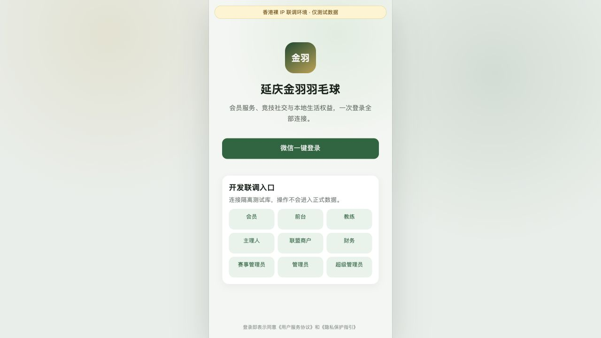
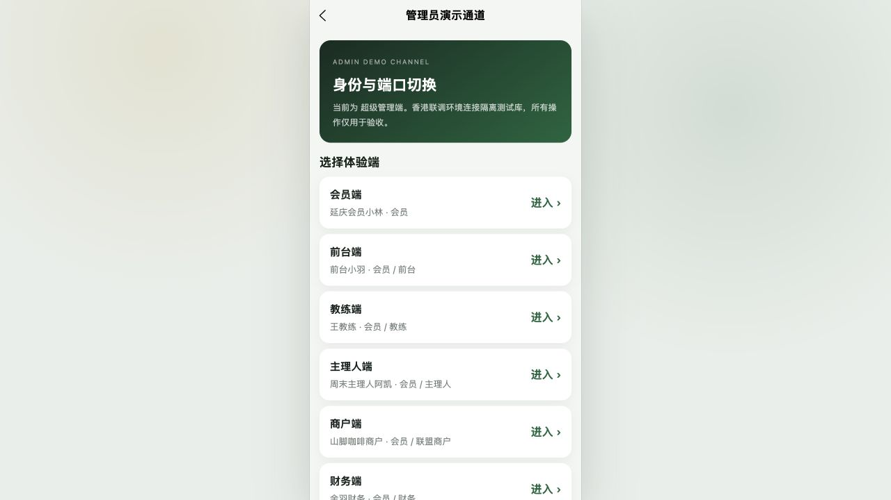
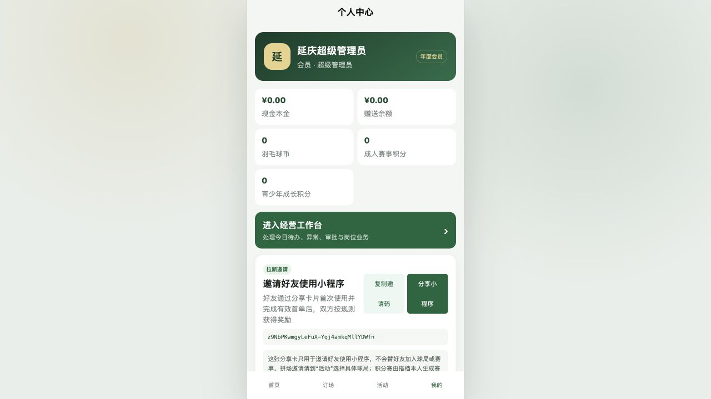
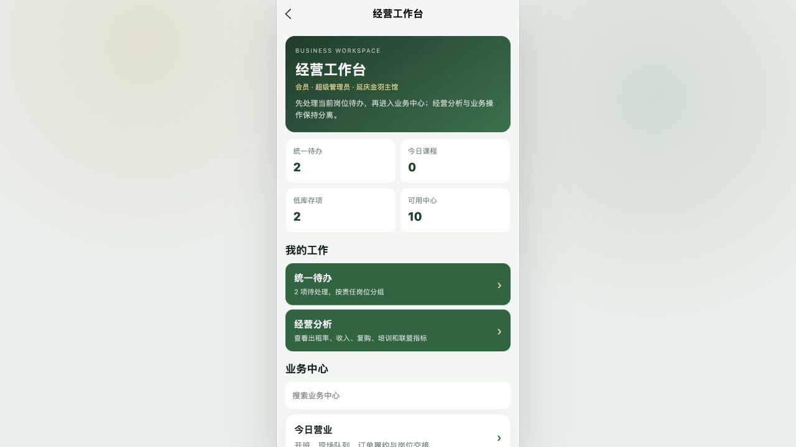

# 香港裸 IP H5 联调验收记录

> 验收日期：2026-09-02
>
> H5：`http://149.104.21.74:8080/`
>
> API：`http://149.104.21.74:3200/api/v1`
> 数据范围：隔离 PostgreSQL 测试库、模拟支付、模拟短信、本地文件存储

## 结论

本轮方案已按“桌面网页固定模拟手机宽度 + 香港裸 IP 远程 API”部署并实测。1280 × 720 桌面视口下，应用主体固定为 390px，居中显示；页面、导航栏和底部标签栏均跟随手机画布，不会被拉成桌面响应式页面。

- 公网 H5、API 和容器内健康检查均返回 200。
- 空库已应用全部迁移并完成 9 类验收账号与演示业务数据初始化。
- `pages.json` 注册的 24/24 个页面均有可见内容，无白屏、无页面级横向越界、无非预期文字裁切。
- 24 页复验期间浏览器 `error` / `warn` 日志均为 0。
- 订场 20 场地矩阵、治理页签保留容器内横向滚动；它们不会带动整个页面横移。
- 管理员验收通道可切换会员、前台、教练、主理人、商户、财务、赛事、管理员和超级管理员；正式构建默认关闭。

## 实际修复

1. 桌面端使用固定 390px 手机画布，手机视口仍使用设备自身宽度。
2. 新增隔离的 staging Docker Compose，不占用服务器现有 Nginx、PostgreSQL 和 Agent Mail 端口。
3. 修复 API 运行镜像缺少 pnpm 工作区、共享包和 Prisma 生成物的问题，迁移与种子命令可在最终镜像内直接执行。
4. 修复开发身份选择的角色串线：优先匹配主身份，只有没有主身份账号时才回退副角色。
5. 补齐独立赛事管理员验收账号，使九个入口对应九类身份。
6. 个人中心五账户由超宽横排改为双列完整展示。
7. 球局运营长球局名由单行裁切改为可换行标签。
8. 工作台指标按岗位权限加载，赛事等单岗位账号不再请求无权访问的培训/库存数据并误报同步失败。
9. H5 入口 HTML 禁止缓存，带哈希的静态资源长期缓存，部署后不再继续加载旧路由逻辑。

## 关键截图

### 裸 IP 联调登录与固定画布

### 管理员身份切换通道

### 个人中心五账户双列布局

### 经营工作台远程数据

## 验收口径

逐页读取可见文本，并检查：应用宽度、页面宽度、手机画布位置、页面级横向越界、非滚动容器文字裁切和浏览器错误日志。远程联调还实际回放了九类身份登录，确认签发令牌并返回目标身份。

本次通过的是 H5 联调验收，不等于微信真机上线验收。微信授权登录、分享卡片、扫码、支付/退款通知、合法域名校验和真机安全区仍须在已备案 HTTPS 域名与微信开发者工具/真机环境补验。

## 安全边界

裸 IP 当前使用 HTTP，只允许测试数据，不录入真实姓名、手机号、支付信息或经营敏感数据。远程身份切换仅为 staging 验收开关；切换正式 API 或生产数据库前必须关闭 `VITE_ENABLE_REMOTE_DEV_LOGIN`，并以 `NODE_ENV=production` 启动 API。
